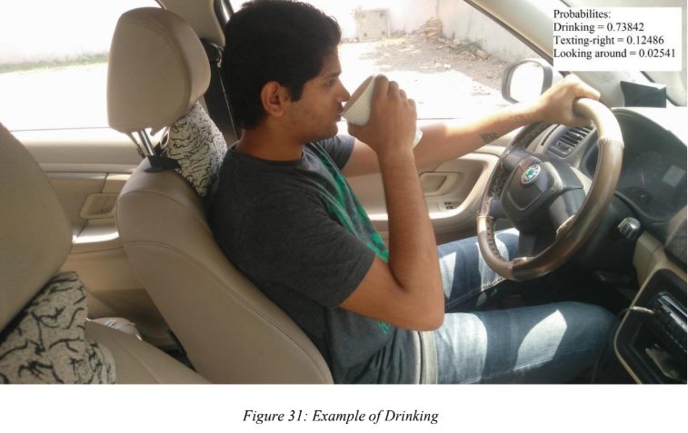

# About the Project

Built a model that will first detect if the driver is distracted or not using Image Processing. If the driver is distracted then using Machine Learning it will classify the type of the distraction of the driver. The driver also will be notified about the type of the distraction to alert him to focus on driving.

#### Types of Distraction:

- c0: safe driving
- c1: texting - right
- c2: talking on the phone - right
- c3: texting - left
- c4: talking on the phone - left
- c5: operating the radio
- c6: drinking
- c7: reaching behind
- c8: hair and makeup
- c9: looking around

#### Classification Model

Convolutional Neural Network VGG16 is used to train and classify images.

# Application

- The Vehicle ad-hoc Networks has emerged as a distinguished branch of wireless communication; that pertains categorically to transportation systems. If the driver is found distracted, then the system sends out an alert to nearest vehicles using ad-hoc networks.
- The system detects a high risk of the driver, then the driver will be alerted by an audible signal.
- Avoid fraud insurance claims by using recorded footage from a driver monitoring camera and driver activity data.

# Built With

- [Python](https://www.python.org/)
- [TensorFlow 1.0.0](https://www.tensorflow.org/)
- [NumPy](https://numpy.org/)
- [OpenCV](https://opencv.org/)
- [Keras](https://keras.io/)
- [Pickle](https://docs.python.org/3/library/pickle.html)
- [CUDA toolkit 8.0](https://developer.nvidia.com/cuda-downloads)
- [AWS](https://aws.amazon.com/)
- [Android](https://developer.android.com/)
- [JSON](https://www.json.org/)

# Flow of the project

- Android application captures the driver’s images using the inbuilt mobile phone camera every T seconds.
- A constant stream of looking around images to the application is an evident case of distraction and it would then be necessary to alert the driver to pay attention. Thus, if the stream of 3 images are distracted, it alerts the driver.
- The camera captures the image in 800x600 resolution so as to reduce the size of the file to be transferred to the AWS server. This is done to reduce the latency of file transfer due to shortfalls in data transfer speeds.
- After the AWS server finishes processing it sends its data to the API which then sends it, in JSON format, to the Android application.
- Response by the server consists of two ‘keys’: - Type/class of distraction: 0-9 for the ten classes - Status message
- Application, on receiving any type other than ‘0’ (which is the class for safe driving), alerts the driver.
- It sends out an alert sound for a period of 2 seconds if the distraction type is other than looking round and then it sends out a <b>Toast</b> (a special type of display format for Android Applications) which displays the type of distraction.

# Results

